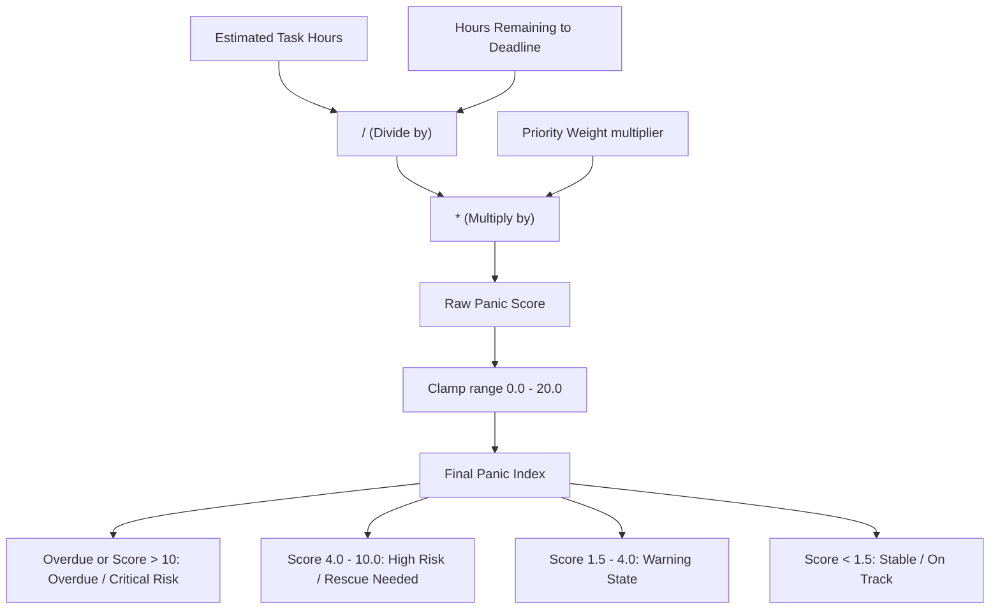
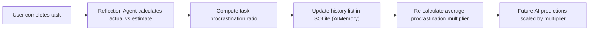
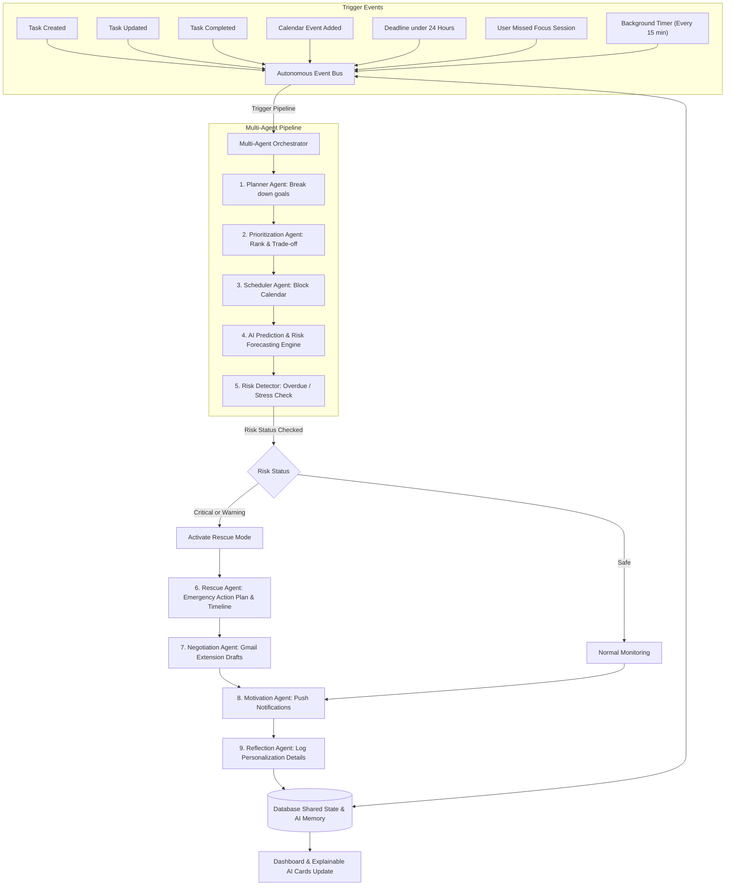
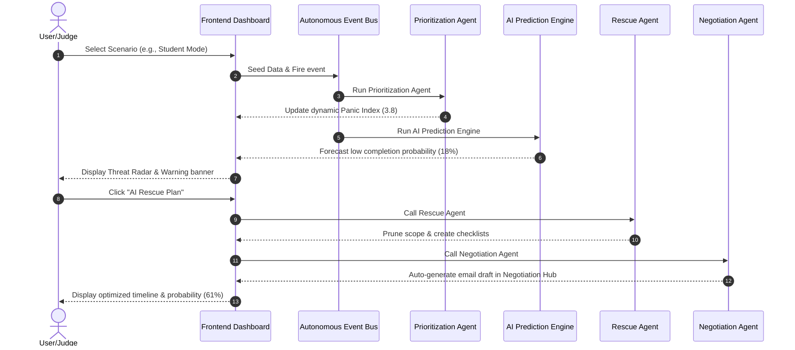

# The Last-Minute Life Saver (LMLS) 🚨⏰

### 🌐 Live Deployed Application: [the-life-saver.vercel.app](https://the-life-saver.vercel.app/)

> **Unlike traditional reminder apps, LMLS continuously predicts failure before it happens, autonomously replans schedules, coordinates multiple AI agents, and proactively intervenes until the user successfully completes the task or reaches the best possible outcome.**

**The Last-Minute Life Saver (LMLS)** is a high-fidelity, AI-powered productivity companion designed to save students, professionals, and entrepreneurs from missing deadlines. Unlike passive reminder apps that are easily ignored, LMLS actively intervenes by running a continuous multi-agent pipeline triggered by database changes and background timers.

---

## 🌟 Key Features

1. **Intelligent Panic-Index Prioritization**: Tasks are ordered dynamically by a *Panic Score*, which factors in estimated duration, remaining hours to deadline, and raw priority weights.
2. **AI Task Decomposer ("Emergency Rescue")**: Decomposes any overwhelming task into 3-5 sequential, bite-sized checklists with duration estimates using Groq / Google Gemini.
3. **AI Prediction & Risk Forecasting Engine**: Predicts deadline failure before it happens, calculates exact completion probabilities, and recommends preventive interventions.
4. **Self-Improving Reflection Agent**: Compares estimates against actual task completion times, detects procrastination trends, logs weights to `AIMemory`, and fine-tunes future prediction iterations.
5. **Google Calendar & Gmail Integration (Simulated / OAuth)**: Syncs external appointments to avoid schedule collisions, and drafts apology or extension emails when completion probabilities drop.
6. **Autonomous Event Bus**: Any database state change (task creation, updates, completion, calendar edits, missed focus blocks) triggers a coordinated multi-agent pipeline in real-time.
7. **Explainable AI & Opportunity Cost Engine**: Compares competing tasks, giving clear trade-off summaries (Task A vs Task B) and Panic Score derivations.

### 📊 Metric Derivation & Feedback Loop Diagrams

#### 1. Panic Index Formula & Priority Scoring Calculation


#### 2. Self-Improving Reflection & AI Memory Feedback Loop


---


## 🏗️ Technical Architecture & Agent Flow

The application coordinates 9 specialized autonomous agents that communicate through a shared state managed by the **Autonomous Event Bus**:



- **Backend**: Python (FastAPI), SQLAlchemy ORM, SQLite Database.
- **AI Core**: Multi-LLM API Client supporting **Groq** (`llama-3.3-70b-versatile`) and **Google Gemini** (`gemini-2.5-flash`), with local fallback heuristics to guarantee offline capability.
- **Frontend**: React (Vite) styled with custom Vanilla CSS featuring glassmorphism elements, circular SVG progress meters, and glowing warning states.
- **Dockerization**: Complete containerization using `docker-compose` with Nginx serving static frontend bundles.

## 🎯 Live Presentation Scenarios

To help judges evaluate the multi-agent system immediately, the app includes a **Live Demo Presentation Module** that seeds pristine, realistic data for 3 distinct personas.

### 🎭 Live Presentation Flow




- **🎓 Student Mode**: Simulates an academic deadline crisis.
  - *Context*: Operating Systems Assignment due in 2 hours with 3.5 hours left. Risk is critical, success probability is `18%`.
  - *Wow Moment*: Clicking **"AI Rescue Plan"** prunes scope (e.g. mocking inputs), generating a detailed schedule and a pre-written Professor apology email in the *Negotiation Hub*. Success probability dynamically transitions to `61%`.
- **💼 Professional Mode**: Simulates a production checkout crash hotfix under calendar congestion.
  - *Context*: Unscheduled client call overlaps a scheduled task focus block.
  - *Wow Moment*: The *Scheduler Agent* automatically detects the calendar clash and replans focus blocks to the next business slot, logging the autonomous rescheduling on the Event Bus in real-time.
- **🚀 Startup Founder Mode**: Simulates an investor Series A Pitch Deck deadline.
  - *Context*: VC pitch deck due in 4 hours with 4.5 hours estimated. Success probability is `12%`.
  - *Wow Moment*: Triggering the rescue plan prunes slides and consolidates financials, boosting success probability to `58%`.

**How to trigger**: Click on the metrics-driven cards (🎓 *Student*, 💼 *Professional*, 🚀 *Founder*) directly in the sidebar. The database re-seeds instantly and triggers a premium details toast.

---

## 🚀 Setup & Execution

### Option 1: Running the App via Docker Compose (Recommended)

1. Create a `.env` file in the project root based on `.env.example`:
   ```env
   GROQ_API_KEY=your_groq_api_key_here
   GEMINI_API_KEY=your_gemini_api_key_here
   PORT=8000
   DATABASE_URL=sqlite:////app/data/lmls.db
   ```

2. Run the build and start command:
   ```bash
   docker-compose up --build
   ```

3. Open your browser and navigate to:
   - **Frontend**: [http://localhost:3000](http://localhost:3000)
   - **API Swagger Documentation**: [http://localhost:8000/docs](http://localhost:8000/docs)

### Option 2: Running Locally (For Development)

If you prefer to run the components directly without Docker:

#### 1. Backend Setup
1. Navigate to the backend directory:
   ```bash
   cd backend
   ```
2. Create and activate a virtual environment (optional but recommended):
   ```bash
   python -m venv venv
   # On Windows:
   .\venv\Scripts\activate
   # On macOS/Linux:
   source venv/bin/activate
   ```
3. Install dependencies:
   ```bash
   pip install -r requirements.txt
   ```
4. Start the FastAPI server:
   ```bash
   uvicorn app.main:app --reload --port 8000
   ```

#### 2. Frontend Setup
1. Navigate to the frontend directory:
   ```bash
   cd frontend
   ```
2. Install dependencies:
   ```bash
   npm install
   ```
3. Start the Vite development server:
   ```bash
   npm run dev
   ```

---

## 🧪 Testing

To run the backend test suite:

1. Navigate to the backend directory:
   ```bash
   cd backend
   ```
2. Run pytest:
   ```bash
   pytest -v
   # Or run via Python module:
   python -m pytest tests/
   ```

---

## 🔌 API Endpoints Reference

The FastAPI backend exposes the following core endpoints:

### Tasks (`/api/tasks`)
- `GET /api/tasks/` - Retrieve all active tasks.
- `POST /api/tasks/` - Create a new task (triggers Event Bus pipeline).
- `PUT /api/tasks/{task_id}` - Update task details (triggers Event Bus pipeline).
- `DELETE /api/tasks/{task_id}` - Delete a task.
- `POST /api/tasks/{task_id}/rescue` - Trigger active Emergency Rescue mode.

### Habits (`/api/habits`)
- `GET /api/habits/` - List all habits and current streaks.
- `POST /api/habits/` - Create a new habit track.
- `POST /api/habits/{habit_id}/log` - Log daily completion.

### Scheduling (`/api/schedule`)
- `GET /api/schedule/` - View scheduled focus blocks.
- `POST /api/schedule/auto-plan` - Force scheduling recalculation.
- `GET /api/schedule/events` - Get Google Calendar events.
- `POST /api/schedule/events` - Create Calendar conflict event.
- `DELETE /api/schedule/events/{event_id}` - Delete Calendar event.
- `POST /api/schedule/sync-google-calendar` - Perform Google Calendar sync.

### AI Assistant & Analytics (`/api/ai`)
- `POST /api/ai/chat` - Chat Command Center.
- `GET /api/ai/recommendations` - Get coaching recommendations.
- `GET /api/ai/health-analysis` - Workload health stats (Productivity score, Burnout risk).
- `POST /api/ai/settings` - Save UserSettings parameters.
- `GET /api/ai/notifications` - Smart warnings alerts.
- `GET /api/ai/agents/activity` - Real-time Multi-Agent activity log stream.
- `GET /api/ai/analytics/dashboard` - Detailed completion charts & AI Rescue Metrics.

### Negotiation drafts (`/api/negotiation`)
- `GET /api/negotiation/drafts` - Get list of email drafts.
- `PUT /api/negotiation/drafts/{draft_id}` - Edit subject/body.
- `POST /api/negotiation/send/{draft_id}` - Push negotiation email to Gmail drafts folder.
- `DELETE /api/negotiation/drafts/{draft_id}` - Delete draft.

---

## 📂 Codebase Directory

```
├── docker-compose.yml       # Monorepo container deployment config
├── backend/
│   ├── app/                 # FastAPI code (config, CRUD, models, routers)
│   ├── tests/               # Pytest test suite (main router integration tests)
│   ├── Dockerfile           # Backend container build script
│   └── requirements.txt     # Python dependencies
└── frontend/
    ├── src/                 # React components, CSS stylesheets, state management
    ├── nginx.conf           # Web server container proxy rules
    └── Dockerfile           # Frontend static build container script
```

---

## 🏆 Hackathon Evaluation Matrix Alignment

This project is explicitly engineered to maximize performance against the 7 core hackathon evaluation criteria:

| Evaluation Criterion | Hackathon Requirement | Project Implementation & Proof Points |
|---|---|---|
| **Problem Solving & Impact (20%)** | Solve a real problem; deliver measurable value. | Moves beyond static alerts by predicting deadline failure, auto-generating bite-sized "Rescue" checklists, blocking Pomodoro calendar focus blocks, and drafting delay apology/negotiation emails. Includes 3 persona walkthrough scenarios. |
| **Agentic Depth (20%)** | Autonomous agents, tool use, feedback loops. | Coordinates 9 specialized agents over a central Event Bus. Includes a self-improving **Reflection Agent** that monitors user actual work times to compute a personalized `procrastination_multiplier` stored in AI Memory, dynamically adjusting all future predictions. |
| **Innovation & Creativity (20%)** | Originality, creative engineering. | Introduces a dynamic mathematical **Panic Index** formula and **Opportunity Cost Engine** explaining precise AI reasoning and percentage risk penalties if specific tasks are skipped. |
| **Usage of Google Technologies (15%)** | Google Cloud, Firebase, Gemini, etc. | Powered by **Google Gemini (gemini-2.5-flash)** using advanced system instructions. Gmail drafts integration ready via Google OAuth settings schema. |
| **Product Experience & Design (10%)** | Wow factor, UI aesthetics, ease of use. | Exquisite futuristic dark-themed glassmorphism UI. Features real-time SVG progress wheels, a live **Threat Radar scanner**, detailed interactive timeline steps, and a live autonomous Agent Activity Feed. |
| **Technical Implementation (10%)** | Code quality, architecture, design patterns. | Clean monorepo with FastAPI asynchronous endpoints, SQLAlchemy ORM with SQLite storage, real-time background orchestration using **APScheduler**, and custom React context state management. |
| **Completeness & Usability (5%)** | Working software, easy installation. | Fully dockerized containerization (`docker-compose up --build`), detailed README instructions, and a Pytest backend validation suite. |

---

## 📝 Developer & Production Notes

- **Database Swapping**: To run PostgreSQL in production, change `DATABASE_URL` in the environment configuration to point to a valid PG server; the code uses declarative SQLAlchemy mappings requiring zero query modifications.
- **CORS Handling**: Cross-Origin resource sharing is allowed dynamically, check `backend/app/main.py` for adjustments before deploying to staging/prod.
- **Offline Mode**: If API credentials expire or are missing, the system utilizes built-in algorithmic heuristics to generate tasks and sub-task lists automatically.
- **Gemini Quota Management**: Optimized for the free-tier daily request limits (20 requests/day cap) by caching generated coach recommendations in the local database and skipping duplicate background agent runs (like `RescueAgent`) if strategies are already active, unless forced by clicking the manual "AI Rescue Plan" button in the UI.
